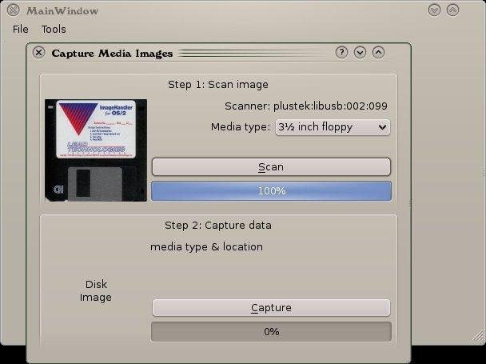
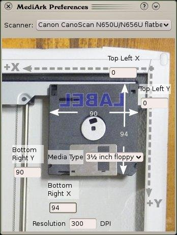

A Qt program which efficiently handles a stream of disks (floppies, CDs or
whatever), capturing optical images using a scanner and simultaneously
grabbing the data contents to disk image files (similar to dd).

Also can browse, search and mount images thus captured.

It was written for Qt 4 but has been ported to Qt 6; it may be a bit broken
now, but it was working around 2009-2010.

It's the first time that I used SANE API for scanners in a C++ program;
hopefully some bits are still reusable.

